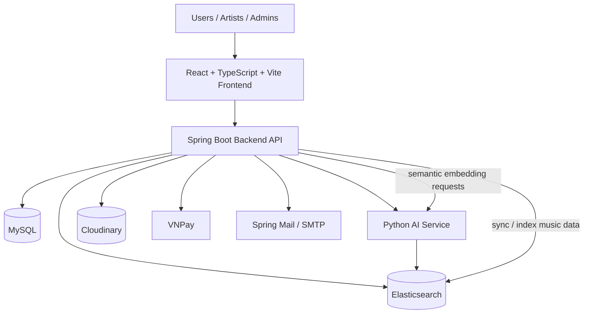

# Music E-commerce Platform

## Project Overview

Music E-commerce Platform is a full-stack web application for buying and managing digital music.

**Purpose**

To develop a secure and scalable digital music commerce platform that integrates intelligent search and copyright management. The system protects digital music using audio watermarking techniques while leveraging Elasticsearch and AI-based audio feature extraction to support full-text search, semantic search, and melody-based music retrieval, providing an efficient experience for users, artists, and administrators.

**Main Objectives**

- To help users efficiently discover, preview, purchase, and download digital music through intelligent search capabilities.
- To enable artists to upload and manage music, protect copyrights using audio watermarking, and monitor sales performance.
- To provide administrators with comprehensive tools to manage users, artists, music catalogs, transactions, and platform operations.
- To enhance music discovery using Elasticsearch and AI-powered technologies, including full-text search, semantic search, and melody-based retrieval, while preserving digital content through audio watermarking.

**Key Highlights**

- Intelligent music search featuring Elasticsearch-powered full-text, semantic, fuzzy, autocomplete, and melody-based retrieval.
- AI-powered semantic search using a Vietnamese bi-encoder and audio feature extraction for music similarity search.
- Audio copyright protection through digital watermarking techniques (DWT + DCT).
- Secure authentication and role-based authorization using Spring Security and JWT.
- Integrated VNPay online payment gateway.
- Cloud-based media storage and management with Cloudinary.

## Features

### User Features

- Register and log in using JWT, log in with Google, recover a forgotten password, and manage account access permissions.
- Search and browse music with smart search functionality.
- Add music to your cart, update licenses you wish to use, and pay online using VNPay.
- Download purchased music.
- View song details and rate music products.

### Artist Features

- Upload and manage music tracks.
- Manage licenses and song availability.
- Track artist revenue statistics.
- Review song performance and catalog information.

### Admin Features

- Manage users, songs, and moderation processes.
- Review pending or reported content.
- Track orders, revenue, and activity on the platform.
- Manage system-level category data such as genre, mood, and topic.

## Highlight Features

- **Intelligent Search**: Combines multiple retrieval strategies to help users find music faster and with better relevance.
- **Semantic Search**: Uses embeddings generated by the AI service to understand the meaning of a query, not just the exact keywords.
- **Full-text Search**: Uses Elasticsearch for lexical matching across indexed music data.
- **Fuzzy Search**: Improves tolerance for typos and partial matches.
- **Autocomplete**: Helps users discover tracks and queries while typing.
- **Audio Copyright Protection**: Adds protection to downloadable audio assets to help deter unauthorized redistribution.
- **Watermarking**: Uses FFmpeg-based processing with configurable watermark timing and volume.
- **Secure Authentication**: Uses Spring Security and JWT to protect application access.
- **Online Payment**: Integrates VNPay for checkout and payment verification.
- **Cloud Storage**: Stores media assets in Cloudinary.
- **AI-powered Capabilities**: Supports Vietnamese semantic embeddings and audio feature extraction for search and similarity workflows.

## System Architecture



## Technology Stack

| Category | Technologies |
|-----------|--------------|
| **Backend** | Java 21, Spring Boot 4, Spring Security, Spring Data JPA, Spring Validation, Spring Mail |
| **Frontend** | React, TypeScript, Vite, Tailwind CSS |
| **Database** | MySQL |
| **Search Engine** | Elasticsearch |
| **Artificial Intelligence** | Python, Hugging Face Transformers, Sentence Transformers, Vietnamese Bi-Encoder |
| **Cloud Services** | Cloudinary |
| **Authentication** | JWT, Google OAuth 2.0 |
| **Payment Gateway** | VNPay |
| **Build & DevOps** | Maven, Docker, GitHub Actions |
| **Development Tools** | IntelliJ IDEA, Visual Studio Code, Postman, Git, ESLint |

## Database Design

The application uses MySQL for transactional data and Elasticsearch for search indexing.

**Main entities**

- User
- Role
- AudioTrack
- AudioTrackLicense
- Cart
- CartItem
- OrderEntity
- OrderDetail
- PaymentTransaction
- Genre
- Mood
- Theme
- License
- AudioTrackReview
- AudioTrackModeration
- EmailVerificationOtp
- Copyright_Info

## REST APIs

| API Group | Purpose |
|---|---|
| `api/auth` | Authentication, login, registration, token-based access |
| `api/users` | User profile and account management |
| `api/audio-tracks` | Track catalog operations |
| `api/artists` | Artist workflows and catalog management |
| `api/cart` | Cart management |
| `api/orders` | Purchase and order management |
| `api/reviews` | Track reviews and ratings |
| `api/genres` | Genre catalog |
| `api/moods` | Mood catalog |
| `api/themes` | Theme catalog |
| `api/admin` | Administrative operations and moderation |
| `api/search` | Intelligent search endpoints |
| `api/admin/sync` | Search index synchronization |

## Search Pipeline

1. The frontend sends search requests from the header search box or search results page.
2. When no advanced filters are active, the frontend uses the hybrid search flow exposed by `api/search/hybrid`.
3. The backend queries Elasticsearch for full-text, fuzzy, and autocomplete-style lexical retrieval.
4. For semantic search, the backend calls the Python AI service to generate Vietnamese embeddings.
5. Search documents are synchronized from MySQL into Elasticsearch through dedicated sync/indexing services.
6. Audio-related search and similarity features use extracted melody vectors from the AI service.
7. The backend returns pageable results to the frontend.

## Security

- Spring Security protects the backend API.
- JWT is used for stateless authentication.
- Role-based authorization separates user, artist, and admin capabilities.
- Sensitive values are externalized in `application-secret.properties` instead of being hard-coded.
- Payment, mail, Cloudinary, Firebase, Google, and VNPay integrations are configured through secret properties.
- The application also includes email verification and password-reset related configuration.

## AI Components

| Component | Purpose |
|---|---|
| Vietnamese Bi-Encoder service | Generates semantic embeddings for query understanding |
| `/api/embed` | Converts text into a 768-dimensional vector for semantic search |
| `/api/extract-audio` | Extracts audio features from uploaded tracks |
| `audio_processor.py` | Builds a 92-dimensional audio vector from MFCC and chroma features |
| Elasticsearch semantic fields | Stores embeddings for similarity search and retrieval |

## Installation

### 1. Clone the repository

```bash
git clone https://github.com/BinhTranThanhNLU/MusicEcommerce.git
cd MusicCommerce
```

### 2. Install dependencies

**Backend**

```bash
cd backend/music
./mvnw clean install
```

On Windows:

```bash
cd backend/music
mvnw.cmd clean install
```

**Frontend**

```bash
cd frontend/ReactMusicCommerce
npm install
```

**AI service**


### 3. Configure environment variables

Copy `backend/music/src/main/resources/application-secret.example` to `backend/music/src/main/resources/application-secret.properties` and fill in the values listed below.

### 4. Start Elasticsearch

Make sure Elasticsearch is running and reachable at `http://localhost:9200`.

### 5. Start the backend

```bash
cd backend/music
./mvnw spring-boot:run
```

On Windows:

```bash
cd backend/music
mvnw.cmd spring-boot:run
```

### 6. Start the frontend

```bash
cd frontend/ReactMusicCommerce
npm run start
```

### 7. Start the AI service

```bash
cd backend/music-ai-service
python app.py
```

## Environment Variables

The following configuration values are used by the project. Some are stored in `application.properties`, while secrets should be placed in `application-secret.properties`.

| Scope | Key | Description |
|---|---|---|
| Backend / Database | `spring.datasource.url` | MySQL connection string for the music database. |
| Backend / Database | `spring.datasource.username` | MySQL username. |
| Backend / Database | `spring.datasource.password` | MySQL password. |
| Backend / API | `server.servlet.context-path` | Backend API base path. |
| Backend / Uploads | `app.audio.upload-dir` | Local directory used for temporary or uploaded audio files. |
| Backend / Security | `spring.security.user.name` | Default Spring Security user name. |
| Backend / Security | `spring.security.user.password` | Default Spring Security password. |
| Backend / Profiles | `spring.profiles.include` | Includes the secret profile. |
| Backend / Search | `spring.elasticsearch.uris` | Elasticsearch server URL. |
| Backend / JWT | `app.jwt.secret` | JWT signing secret. |
| Backend / JWT | `app.jwt.expiration-ms` | JWT expiration time in milliseconds. |
| Backend / Google | `app.google.client-id` | Google client ID used for Google authentication. |
| Backend / Firebase | `app.firebase.enabled` | Enables or disables Firebase integration. |
| Backend / Firebase | `app.firebase.credentials-path` | Firebase service account credentials path. |
| Backend / Firebase | `app.firebase.bucket-name` | Firebase storage bucket name. |
| Backend / Cloudinary | `app.cloudinary.cloud-name` | Cloudinary cloud name. |
| Backend / Cloudinary | `app.cloudinary.api-key` | Cloudinary API key. |
| Backend / Cloudinary | `app.cloudinary.api-secret` | Cloudinary API secret. |
| Backend / FFmpeg | `app.ffmpeg.binary-path` | Path to the FFmpeg binary. |
| Backend / FFmpeg | `app.ffmpeg.ffprobe-path` | Path to the FFprobe binary. |
| Backend / FFmpeg | `app.ffmpeg.watermark-interval-seconds` | Interval used when inserting watermark segments. |
| Backend / FFmpeg | `app.ffmpeg.beep-active-seconds` | Duration of the active watermark beep. |
| Backend / FFmpeg | `app.ffmpeg.original-volume` | Volume level for original audio during watermarking. |
| Backend / FFmpeg | `app.ffmpeg.watermark-volume` | Volume level for the watermark signal. |
| Backend / Mail | `spring.mail.host` | SMTP host for outgoing email. |
| Backend / Mail | `spring.mail.port` | SMTP port. |
| Backend / Mail | `spring.mail.username` | SMTP username. |
| Backend / Mail | `spring.mail.password` | SMTP password. |
| Backend / Mail | `app.mail.from` | Sender address used by the application. |
| Backend / Mail | `app.frontend.reset-password-url` | Frontend URL for password reset flows. |
| Backend / Payment | `vnpay.tmn-code` | VNPay merchant code. |
| Backend / Payment | `vnpay.hash-secret` | VNPay secret key. |
| Backend / Payment | `vnpay.pay-url` | VNPay payment URL. |
| Backend / Payment | `app.frontend.checkout-url` | Frontend URL used after VNPay verification. |
| AI / Search | `huggingface.api.key` | Hugging Face API key used by the AI workflow. |
| Frontend | `VITE_GOOGLE_CLIENT_ID` | Google client ID exposed to the React app. |


## Future Improvements

- Add automated backend and frontend test coverage.
- Add containerized local development with Docker Compose.
- Expand observability with structured logs, metrics, and tracing.
- Improve recommendation and ranking quality with richer behavior signals.
- Add CI checks for linting, formatting, and build validation.
- Add production deployment documentation.